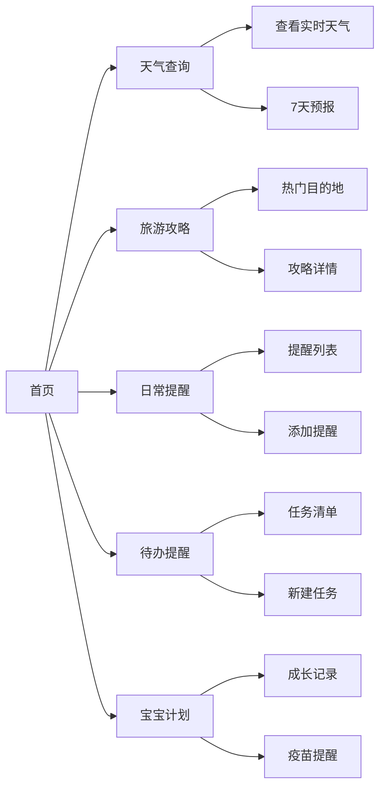

## 1. 产品概述

家庭日常生活APP是一款面向家庭用户的一站式生活管理应用，整合天气查询、旅游攻略、日常提醒、待办事项和宝宝成长计划等核心功能，帮助家庭高效管理日常生活。

- **目标用户**：有孩子的家庭用户、注重生活规划的年轻家庭
- **核心价值**：一个APP搞定家庭日常，让生活更有条理、更有温度

## 2. 核心功能

### 2.1 用户角色

| 角色 | 注册方式 | 核心权限 |
|------|----------|----------|
| 家庭成员 | 本地使用（无需注册） | 使用所有功能，管理个人数据 |

### 2.2 功能模块

1. **首页**：天气概览、今日提醒、快捷入口
2. **天气查询**：实时天气、未来7天预报、生活指数
3. **旅游攻略**：热门目的地、攻略推荐、行程规划
4. **日常提醒**：周期性提醒、重要日期、自定义提醒
5. **待办提醒**：任务清单、优先级、完成状态
6. **宝宝计划**：成长记录、疫苗提醒、发育里程碑

### 2.3 页面详情

| 页面名称 | 模块名称 | 功能描述 |
|----------|----------|----------|
| 首页 | 天气卡片 | 显示当前城市天气、温度、天气图标 |
| 首页 | 今日提醒 | 展示今日待办和提醒事项 |
| 首页 | 快捷入口 | 五大功能模块快速导航 |
| 天气页 | 实时天气 | 当前温度、湿度、风力、空气质量 |
| 天气页 | 7天预报 | 未来一周天气趋势图表 |
| 天气页 | 生活指数 | 穿衣、紫外线、运动等指数 |
| 旅游攻略页 | 热门目的地 | 精选旅游城市卡片展示 |
| 旅游攻略页 | 攻略列表 | 按目的地分类的攻略文章 |
| 旅游攻略页 | 行程规划 | 自定义行程天数和景点 |
| 日常提醒页 | 提醒列表 | 按时间排序的提醒事项 |
| 日常提醒页 | 添加提醒 | 设置提醒内容、时间、重复周期 |
| 待办页 | 任务列表 | 待办事项清单，支持勾选完成 |
| 待办页 | 任务管理 | 添加、编辑、删除任务，设置优先级 |
| 宝宝计划页 | 宝宝信息 | 宝宝头像、姓名、生日、月龄 |
| 宝宝计划页 | 成长记录 | 身高体重记录、成长曲线 |
| 宝宝计划页 | 疫苗提醒 | 疫苗接种时间表和提醒 |
| 宝宝计划页 | 发育里程碑 | 各阶段发育标志记录 |

## 3. 核心流程

用户打开APP后，首先看到首页天气概览和今日提醒，可通过底部导航切换到各功能模块。每个模块支持数据的增删改查操作，数据存储在本地。

## 4. 用户界面设计

### 4.1 设计风格

- **主色调**：温暖橙色 `#FF8C42`，传递家庭温馨感
- **辅助色**：柔和绿色 `#6BCB77`，代表成长与希望
- **中性色**：米白背景 `#FFFAF5`、深灰文字 `#2D3436`
- **按钮风格**：圆角胶囊形按钮，带有柔和阴影
- **字体**：圆润现代的无衬线字体，标题使用更具亲和力的字体
- **布局风格**：卡片式布局，底部Tab导航，大圆角设计
- **图标风格**：线性图标，圆润线条，与整体风格统一

### 4.2 页面设计概览

| 页面名称 | 模块名称 | UI元素 |
|----------|----------|--------|
| 首页 | 天气卡片 | 渐变背景、大温度数字、天气图标动画 |
| 首页 | 功能入口 | 彩色图标、网格布局、悬停上浮效果 |
| 天气页 | 预报图表 | 折线图/柱状图、平滑动画 |
| 旅游攻略页 | 目的地卡片 | 图片+文字叠加、圆角卡片、hover缩放 |
| 待办页 | 任务列表 | 复选框动画、划掉效果、优先级标签 |
| 宝宝计划页 | 成长曲线 | 图表展示、里程碑标记、可爱插画风格 |

### 4.3 响应式

- 采用移动端优先的设计理念
- 桌面端居中展示，最大宽度限制为480px（模拟手机界面）
- 触控友好，按钮尺寸不小于44px
- 支持横竖屏切换适配

### 4.4 动效设计

- 页面切换：平滑的淡入淡出+滑动效果
- 卡片悬停：轻微上浮+阴影加深
- 任务完成：勾选动画+文字划掉效果
- 天气图标：根据天气状态有微动效（下雨、飘雪等）
- 加载状态：骨架屏+脉冲动画
