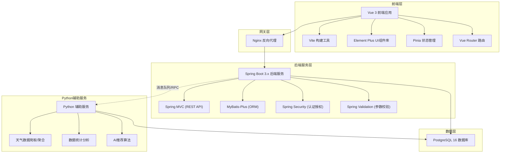

## 1. 总体架构设计



## 2. 技术选型详细说明

### 2.1 前端技术栈

| 技术 | 版本 | 用途 | 选型理由 |
|------|------|------|----------|
| Vue | 3.4.x | 前端框架 | 渐进式框架，上手简单，生态丰富，国内社区活跃 |
| TypeScript | 5.x | 类型系统 | 类型安全，提升代码质量，便于大型项目维护 |
| Vite | 5.x | 构建工具 | 极速开发体验，热更新快，原生ESM支持 |
| Vue Router | 4.x | 路由管理 | Vue官方路由，与Vue3完美配合 |
| Pinia | 2.x | 状态管理 | Vue官方推荐，替代Vuex，更简洁的API |
| Element Plus | 2.x | UI组件库 | 国内最流行的Vue3组件库，组件丰富，文档完善 |
| Tailwind CSS | 3.x | 原子化CSS | 快速开发，一致性设计，减少CSS体积 |
| Axios | 1.x | HTTP客户端 | 最流行的HTTP库，拦截器、取消请求等功能完善 |
| ECharts | 5.x | 图表库 | 功能强大的图表库，支持成长曲线等数据可视化 |
| dayjs | 1.x | 日期处理 | 轻量日期库，API简洁，替代Moment.js |

### 2.2 后端技术栈

| 技术 | 版本 | 用途 | 选型理由 |
|------|------|------|----------|
| Java | 21 (LTS) | 开发语言 | 最新LTS版本，性能提升，虚拟线程支持，长期维护 |
| Spring Boot | 3.2.x | 应用框架 | 最流行的Java微服务框架，自动配置，快速开发 |
| Spring MVC | 6.x | Web框架 | Spring Boot内置，RESTful API开发 |
| MyBatis-Plus | 3.5.x | ORM框架 | 增强版MyBatis，CRUD开箱即用，分页插件等 |
| Spring Security | 6.x | 安全框架 | 认证授权，JWT集成，权限控制 |
| Spring Validation | 3.x | 参数校验 | 注解式参数校验，减少重复代码 |
| JJWT | 0.12.x | JWT工具 | JWT生成与验证，无状态认证 |
| Lombok | 1.18.x | 代码简化 | 注解式代码生成，减少样板代码 |
| Hutool | 5.x | 工具类库 | 国产全能工具库，功能丰富，中文文档 |
| Redis | 7.x | 缓存 | 热门缓存，提升性能，Session存储 |
| SpringDoc OpenAPI | 2.x | API文档 | 自动生成Swagger文档，前后端联调方便 |

### 2.3 数据库技术

| 技术 | 版本 | 用途 | 选型理由 |
|------|------|------|----------|
| PostgreSQL | 16.x | 关系型数据库 | 功能最强大的开源数据库，JSON支持好，扩展性强 |
| PgAdmin | 4.x | 数据库管理 | PostgreSQL官方管理工具 |
| Flyway | 10.x | 数据库迁移 | 版本化数据库管理，团队协作，多环境同步 |

### 2.4 Python辅助技术栈

| 技术 | 版本 | 用途 | 选型理由 |
|------|------|------|----------|
| Python | 3.12 | 脚本语言 | 数据处理能力强，AI/ML生态丰富 |
| FastAPI | 0.110.x | API框架 (可选) | 高性能Python Web框架，异步支持 |
| Requests | 2.31.x | HTTP请求 | 最流行的Python HTTP库 |
| Beautiful Soup | 4.x | 网页爬虫 | 解析HTML，爬取旅游攻略等数据 |
| Pandas | 2.x | 数据分析 | 强大的数据分析库，处理成长数据统计 |
| APScheduler | 3.x | 定时任务 | Python定时任务框架，用于数据同步 |
| SQLAlchemy | 2.x | ORM (Python) | Python最流行的ORM，连接PostgreSQL |

## 3. 项目目录结构

```
family-life-app/
├── frontend/                    # Vue前端项目
│   ├── public/
│   ├── src/
│   │   ├── api/                 # API接口封装
│   │   ├── assets/              # 静态资源
│   │   ├── components/          # 公共组件
│   │   ├── composables/         # 组合式函数
│   │   ├── layouts/             # 布局组件
│   │   ├── router/              # 路由配置
│   │   ├── stores/              # Pinia状态
│   │   ├── types/               # TypeScript类型
│   │   ├── utils/               # 工具函数
│   │   ├── views/               # 页面组件
│   │   ├── App.vue
│   │   └── main.ts
│   ├── index.html
│   ├── package.json
│   ├── tsconfig.json
│   ├── vite.config.ts
│   └── tailwind.config.js
│
├── backend/                     # Java后端项目
│   ├── src/
│   │   ├── main/
│   │   │   ├── java/
│   │   │   │   └── com/family/app/
│   │   │   │       ├── FamilyApplication.java
│   │   │   │       ├── common/       # 公共模块
│   │   │   │       │   ├── result/    # 统一响应结果
│   │   │   │       │   ├── exception/ # 全局异常处理
│   │   │   │       │   └── util/      # 工具类
│   │   │   │       ├── config/       # 配置类
│   │   │   │       │   ├── SecurityConfig.java
│   │   │   │       │   ├── MybatisPlusConfig.java
│   │   │   │       │   └── CorsConfig.java
│   │   │   │       ├── controller/   # 控制层
│   │   │   │       │   ├── WeatherController.java
│   │   │   │       │   ├── TravelController.java
│   │   │   │       │   ├── ReminderController.java
│   │   │   │       │   ├── TodoController.java
│   │   │   │       │   └── BabyController.java
│   │   │   │       ├── service/      # 服务层
│   │   │   │       │   ├── impl/
│   │   │   │       │   ├── WeatherService.java
│   │   │   │       │   ├── TravelService.java
│   │   │   │       │   ├── ReminderService.java
│   │   │   │       │   ├── TodoService.java
│   │   │   │       │   └── BabyService.java
│   │   │   │       ├── mapper/       # 数据访问层
│   │   │   │       ├── entity/       # 实体类
│   │   │   │       ├── dto/          # 数据传输对象
│   │   │   │       └── vo/           # 视图对象
│   │   │   └── resources/
│   │   │       ├── application.yml
│   │   │       ├── mapper/           # MyBatis XML
│   │   │       └── db/migration/     # Flyway迁移脚本
│   │   └── test/
│   └── pom.xml
│
├── python/                      # Python辅助服务
│   ├── src/
│   │   ├── crawlers/            # 爬虫模块
│   │   │   ├── weather.py       # 天气数据爬取
│   │   │   └── travel.py        # 旅游攻略爬取
│   │   ├── analysis/            # 数据分析模块
│   │   │   ├── growth_stats.py  # 宝宝成长数据分析
│   │   │   └── reports.py       # 统计报表生成
│   │   ├── ai/                  # AI模块 (可选)
│   │   │   └── recommend.py     # 智能推荐
│   │   └── common/
│   │       ├── db.py            # 数据库连接
│   │       └── utils.py
│   ├── scripts/                 # 独立脚本
│   │   └── init_data.py         # 初始化数据
│   ├── requirements.txt
│   └── README.md
│
├── docker/                      # Docker配置
│   ├── docker-compose.yml
│   ├── nginx/
│   │   └── nginx.conf
│   ├── postgres/
│   │   └── init.sql
│   └── backend/
│       └── Dockerfile
│
└── docs/                        # 项目文档
    ├── API.md
    ├── DATABASE.md
    └── DEPLOY.md
```

## 4. 数据库设计（PostgreSQL）

### 4.1 ER图

```mermaid
erDiagram
    USERS {
        bigint id PK
        varchar username
        varchar password
        varchar nickname
        varchar email
        varchar avatar
        timestamp created_at
        timestamp updated_at
    }
    
    WEATHER_CITIES {
        bigint id PK
        varchar city_name
        varchar province
        varchar country
        decimal longitude
        decimal latitude
    }
    
    WEATHER_RECORDS {
        bigint id PK
        bigint city_id FK
        date record_date
        decimal temperature
        decimal feels_like
        decimal humidity
        decimal wind_speed
        varchar wind_direction
        integer air_quality_index
        varchar air_quality_level
        varchar condition
        integer uv_index
        decimal visibility
        timestamp created_at
    }
    
    WEATHER_FORECAST {
        bigint id PK
        bigint city_id FK
        date forecast_date
        decimal temp_high
        decimal temp_low
        varchar condition
        varchar condition_icon
        integer precipitation
        timestamp created_at
    }
    
    LIFE_INDEX {
        bigint id PK
        bigint city_id FK
        date record_date
        varchar index_type
        varchar index_level
        varchar description
    }
    
    TRAVEL_GUIDES {
        bigint id PK
        varchar title
        varchar destination
        varchar image_url
        varchar description
        text content
        varchar duration
        varchar budget
        varchar best_season
        integer view_count
        integer like_count
        timestamp created_at
        timestamp updated_at
    }
    
    TRAVEL_HIGHLIGHTS {
        bigint id PK
        bigint guide_id FK
        varchar highlight
    }
    
    REMINDERS {
        bigint id PK
        bigint user_id FK
        varchar title
        time remind_time
        varchar repeat_type
        varchar category
        text note
        boolean enabled
        timestamp created_at
        timestamp updated_at
    }
    
    TODOS {
        bigint id PK
        bigint user_id FK
        varchar title
        varchar priority
        varchar category
        date due_date
        boolean completed
        timestamp completed_at
        timestamp created_at
        timestamp updated_at
    }
    
    BABIES {
        bigint id PK
        bigint user_id FK
        varchar name
        date birthday
        varchar gender
        varchar avatar
        timestamp created_at
        timestamp updated_at
    }
    
    GROWTH_RECORDS {
        bigint id PK
        bigint baby_id FK
        date record_date
        decimal height
        decimal weight
        decimal head_circumference
        text note
        timestamp created_at
    }
    
    VACCINES {
        bigint id PK
        varchar name
        varchar age_range
        integer dose_number
        varchar description
    }
    
    BABY_VACCINES {
        bigint id PK
        bigint baby_id FK
        bigint vaccine_id FK
        date planned_date
        date actual_date
        boolean completed
        text note
    }
    
    MILESTONES {
        bigint id PK
        bigint baby_id FK
        varchar title
        text description
        date achieved_date
        boolean achieved
        varchar age_milestone
        varchar image_url
        timestamp created_at
    }
```



### 4.2 索引设计

- `users`: `username` (唯一索引), `email` (唯一索引)
- `weather_records`: `city_id + record_date` (联合唯一索引)
- `weather_forecast`: `city_id + forecast_date` (联合唯一索引)
- `reminders`: `user_id + remind_time` (联合索引)
- `todos`: `user_id + due_date` (联合索引), `user_id + completed` (联合索引)
- `growth_records`: `baby_id + record_date` (联合唯一索引)

## 5. API接口设计

### 5.1 统一响应格式

```json
{
  "code": 200,
  "message": "success",
  "data": {},
  "timestamp": 1234567890
}
```

### 5.2 接口清单

| 模块 | 接口 | 方法 | 描述 |
|------|------|------|------|
| 认证 | /api/auth/login | POST | 用户登录 |
| 认证 | /api/auth/register | POST | 用户注册 |
| 认证 | /api/auth/user-info | GET | 获取当前用户信息 |
| 天气 | /api/weather/current | GET | 获取当前天气 |
| 天气 | /api/weather/forecast | GET | 获取7天预报 |
| 天气 | /api/weather/life-index | GET | 获取生活指数 |
| 天气 | /api/weather/cities | GET | 获取城市列表 |
| 旅游 | /api/travel/guides | GET | 获取攻略列表 |
| 旅游 | /api/travel/guides/:id | GET | 获取攻略详情 |
| 旅游 | /api/travel/hot | GET | 热门目的地 |
| 提醒 | /api/reminders | GET | 获取提醒列表 |
| 提醒 | /api/reminders | POST | 创建提醒 |
| 提醒 | /api/reminders/:id | PUT | 更新提醒 |
| 提醒 | /api/reminders/:id | DELETE | 删除提醒 |
| 提醒 | /api/reminders/:id/toggle | PUT | 切换提醒开关 |
| 待办 | /api/todos | GET | 获取待办列表 |
| 待办 | /api/todos | POST | 创建待办 |
| 待办 | /api/todos/:id | PUT | 更新待办 |
| 待办 | /api/todos/:id | DELETE | 删除待办 |
| 待办 | /api/todos/:id/complete | PUT | 标记完成/取消 |
| 宝宝 | /api/baby/info | GET | 获取宝宝信息 |
| 宝宝 | /api/baby/info | PUT | 更新宝宝信息 |
| 宝宝 | /api/baby/growth | GET | 成长记录列表 |
| 宝宝 | /api/baby/growth | POST | 添加成长记录 |
| 宝宝 | /api/baby/growth/:id | DELETE | 删除成长记录 |
| 宝宝 | /api/baby/vaccines | GET | 疫苗列表 |
| 宝宝 | /api/baby/vaccines/:id/toggle | PUT | 标记疫苗完成 |
| 宝宝 | /api/baby/milestones | GET | 里程碑列表 |
| 宝宝 | /api/baby/milestones/:id/toggle | PUT | 标记里程碑达成 |

### 5.3 认证方式

- 采用 JWT (JSON Web Token) 无状态认证
- Token 存储在请求头 `Authorization: Bearer <token>`
- Token 有效期：7天，支持刷新
- Spring Security 过滤器链验证

## 6. 前后端联调方案

### 6.1 开发环境

- 前端开发端口：5173 (Vite)
- 后端开发端口：8080 (Spring Boot)
- 数据库端口：5432 (PostgreSQL)
- Redis端口：6379

### 6.2 跨域处理

- 开发环境：Vite proxy 代理 `/api` 到后端
- 生产环境：Nginx 反向代理

### 6.3 环境变量

前端 `.env.development`:
```
VITE_API_BASE_URL=/api
VITE_APP_TITLE=家庭生活助手
```

后端 `application-dev.yml`:
```yaml
spring:
  datasource:
    url: jdbc:postgresql://localhost:5432/family_app
    username: postgres
    password: postgres
```

## 7. Python辅助服务集成方案

### 7.1 服务定位

Python不作为主服务，而是作为**辅助工具/脚本**存在，负责：

1. **数据采集**：爬取天气数据、旅游攻略信息，存入PostgreSQL
2. **数据分析**：统计宝宝成长数据，生成分析报告
3. **AI推荐**：基于用户行为推荐旅游目的地（可选扩展）
4. **定时任务**：每日定时更新天气数据，同步信息

### 7.2 集成方式

**方案一：独立脚本（推荐初始阶段）**
- Python脚本直接连接PostgreSQL数据库
- 通过定时任务（cron/APScheduler）定期执行
- 无需额外的API层

**方案二：FastAPI微服务（扩展阶段）**
- Python提供独立的API服务
- Java后端通过HTTP调用Python服务
- 适用于复杂的AI/数据处理场景

### 7.3 数据流向

```
天气API/旅游网站 → Python爬虫 → PostgreSQL → Java后端 → Vue前端
Python数据分析脚本 → PostgreSQL → Java后端 → 报表展示
```

## 8. 部署方案

### 8.1 Docker Compose 一键部署

```yaml
# docker-compose.yml
services:
  postgres:
    image: postgres:16
    environment:
      POSTGRES_DB: family_app
      POSTGRES_USER: postgres
      POSTGRES_PASSWORD: postgres
    volumes:
      - postgres_data:/var/lib/postgresql/data
  
  redis:
    image: redis:7-alpine
  
  backend:
    build: ./backend
    ports:
      - "8080:8080"
    depends_on:
      - postgres
      - redis
  
  frontend:
    build: ./frontend
    ports:
      - "80:80"
    depends_on:
      - backend
  
  python-worker:
    build: ./python
    depends_on:
      - postgres
```

### 8.2 部署流程

1. 构建前端静态文件 → Nginx托管
2. 构建后端Jar包 → Docker容器运行
3. PostgreSQL数据卷持久化
4. Python脚本定时执行

## 9. 技术选型总结

| 层次 | 技术选择 | 核心理由 |
|------|----------|----------|
| 前端 | Vue 3 + TypeScript + Element Plus + Vite | 开发效率高，生态好，国内社区活跃 |
| 后端 | Java 21 + Spring Boot 3 + MyBatis-Plus | 稳定可靠，企业级首选，性能优秀 |
| 数据库 | PostgreSQL 16 | 功能强大，JSON支持好，开源免费 |
| Python | 3.12 + Pandas + Requests | 数据处理、爬虫、AI能力强 |
| 缓存 | Redis 7 | 性能高，支持多种数据结构 |
| 部署 | Docker + Docker Compose | 环境一致性，一键部署 |

## 10. 从现有项目迁移计划

1. **第一阶段**：搭建Java后端骨架，创建数据库表结构
2. **第二阶段**：开发后端API接口（天气、旅游、提醒、待办、宝宝）
3. **第三阶段**：将现有React前端迁移为Vue前端，对接后端API
4. **第四阶段**：开发Python辅助脚本（数据初始化、爬虫等）
5. **第五阶段**：联调测试，Docker部署
