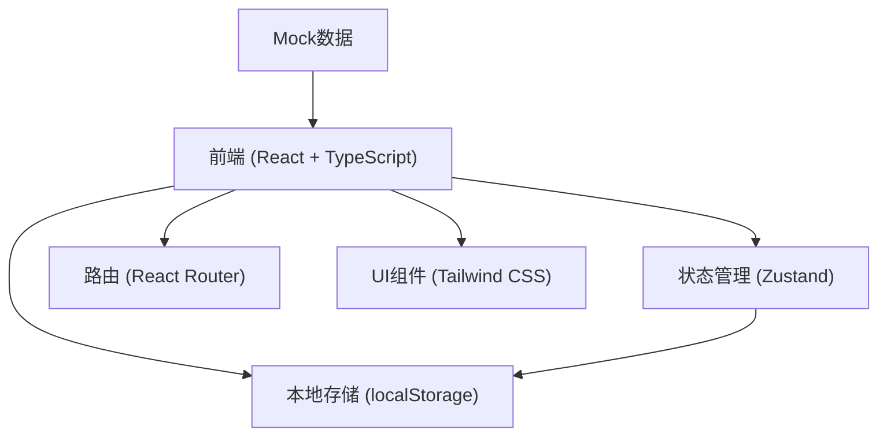
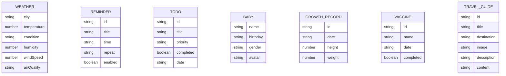

## 1. 架构设计



## 2. 技术描述

- **前端框架**：React 18 + TypeScript
- **构建工具**：Vite
- **样式方案**：Tailwind CSS 3
- **状态管理**：Zustand
- **路由管理**：React Router DOM
- **图标库**：Lucide React
- **数据存储**：localStorage（本地持久化）
- **数据来源**：Mock数据（前端模拟）
- **初始化工具**：vite-init

## 3. 路由定义

| 路由 | 页面 | 用途 |
|------|------|------|
| / | 首页 | 天气概览、今日提醒、快捷入口 |
| /weather | 天气查询 | 实时天气、7天预报、生活指数 |
| /travel | 旅游攻略 | 热门目的地、攻略列表 |
| /travel/:id | 攻略详情 | 具体攻略内容展示 |
| /reminders | 日常提醒 | 提醒列表、添加提醒 |
| /todos | 待办提醒 | 任务清单、任务管理 |
| /baby | 宝宝计划 | 成长记录、疫苗提醒、里程碑 |

## 4. 数据模型

### 4.1 数据模型定义



### 4.2 状态管理切片

```typescript
// 天气状态
interface WeatherState {
  currentWeather: Weather;
  forecast: ForecastDay[];
  lifeIndex: LifeIndex[];
}

// 提醒状态
interface ReminderState {
  reminders: Reminder[];
  addReminder: (reminder: Reminder) => void;
  toggleReminder: (id: string) => void;
  deleteReminder: (id: string) => void;
}

// 待办状态
interface TodoState {
  todos: Todo[];
  addTodo: (todo: Todo) => void;
  toggleTodo: (id: string) => void;
  deleteTodo: (id: string) => void;
}

// 宝宝状态
interface BabyState {
  babyInfo: Baby;
  growthRecords: GrowthRecord[];
  vaccines: Vaccine[];
  milestones: Milestone[];
}
```

## 5. 项目目录结构

```
src/
├── components/          # 公共组件
│   ├── Layout/         # 布局组件（底部导航等）
│   ├── Card/           # 卡片组件
│   └── common/         # 通用组件
├── pages/              # 页面组件
│   ├── Home/           # 首页
│   ├── Weather/        # 天气页
│   ├── Travel/         # 旅游攻略页
│   ├── Reminders/      # 日常提醒页
│   ├── Todos/          # 待办页
│   └── Baby/           # 宝宝计划页
├── store/              # 状态管理
│   └── index.ts
├── data/               # Mock数据
│   └── mockData.ts
├── types/              # TypeScript类型定义
│   └── index.ts
├── utils/              # 工具函数
│   └── storage.ts
├── App.tsx
├── main.tsx
└── index.css
```

## 6. 核心技术决策

1. **纯前端实现**：无后端依赖，所有数据存储在localStorage，方便演示和离线使用
2. **移动端优先**：采用移动端APP的设计风格，桌面端居中显示模拟手机界面
3. **组件化开发**：每个功能模块独立，便于后续扩展和维护
4. **本地持久化**：使用localStorage存储用户数据，刷新页面不丢失
5. **Mock数据**：预置丰富的示例数据，确保首次打开即有内容展示
